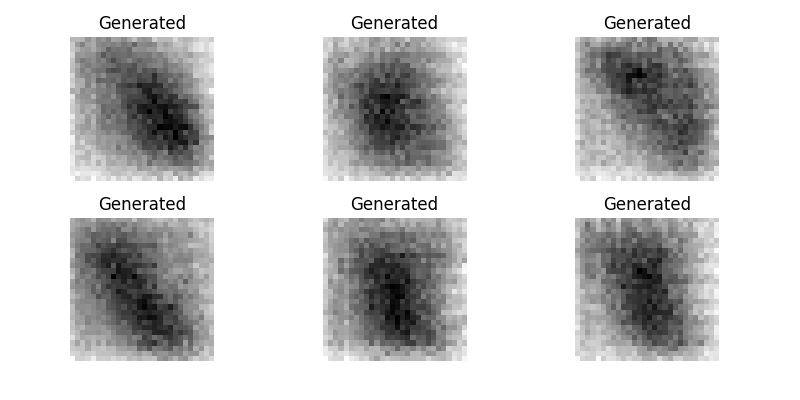
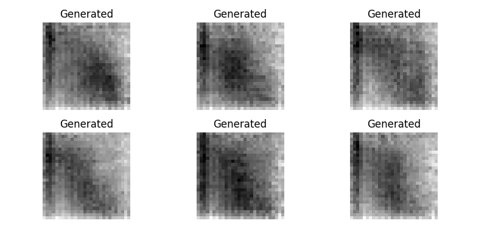
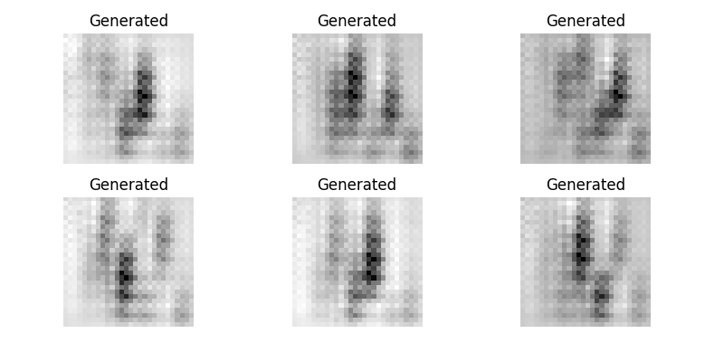
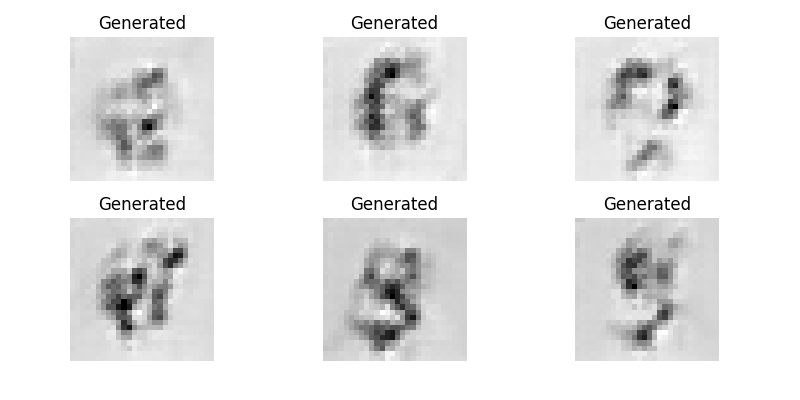
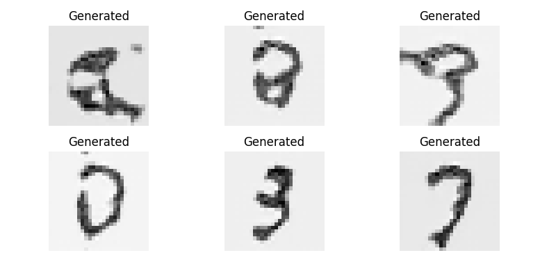

# 🎨 Generative Adversarial Network (GAN) — PyTorch + PyTorch Lightning

This repository contains a clean and minimal implementation of a **Generative Adversarial Network (GAN)** built from scratch using **PyTorch** and **PyTorch Lightning**. The goal is to generate handwritten digits resembling those in the MNIST dataset using adversarial training between a **Generator** and a **Discriminator**.

---

## 📁 Project Structure

```
.
├── gan_pytorch.ipynb      # Jupyter Notebook with GAN implementation
├── lightning_logs/        # Training logs saved by PyTorch Lightning
├── data/                  # MNIST data (downloaded via DataModule)
└── README.md              # Project documentation (this file)
```

---

## ⚙️ Requirements

To install dependencies, run:

```bash
pip install -r requirements.txt
```

---

## 🚀 Training

You can train the GAN by running the notebook or using a Lightning `Trainer`. The generator learns to produce realistic handwritten digits, while the discriminator learns to distinguish real from fake ones.

Training is done using **manual optimization** to update the generator and discriminator independently.

---

## 🧠 Model Summary

- **Generator**: Uses fully connected layers followed by transposed convolutions to upsample a latent vector into a 28×28 grayscale image.
- **Discriminator**: A lightweight CNN that classifies images as real or fake.

---

## 📊 Sample Outputs

Below are generated samples from the generator across the first 5 epochs:

| Epoch   | Output |
|---------|--------|
| EPOCH 1 |  |
| EPOCH 2 |  |
| EPOCH 3 |  |
| EPOCH 4 |  |
| EPOCH 20 |  |

---

## 📈 Logging

Training losses (`g_loss`, `d_loss`) are logged using PyTorch Lightning’s built-in logger. For better visualizations, consider integrating with **TensorBoard** or **Weights & Biases**.

---

## 👨‍💻 About Me

Hi! I'm **Yash Gupta**, a Machine Learning & AI engineer passionate about building deep learning models, computer vision applications, and scalable ML systems. I enjoy diving deep into the theory while crafting practical, real-world solutions.

If you found this project helpful, feel free to ⭐ the repository and connect with me on [LinkedIn](https://www.linkedin.com/in/eryash15)!

---
